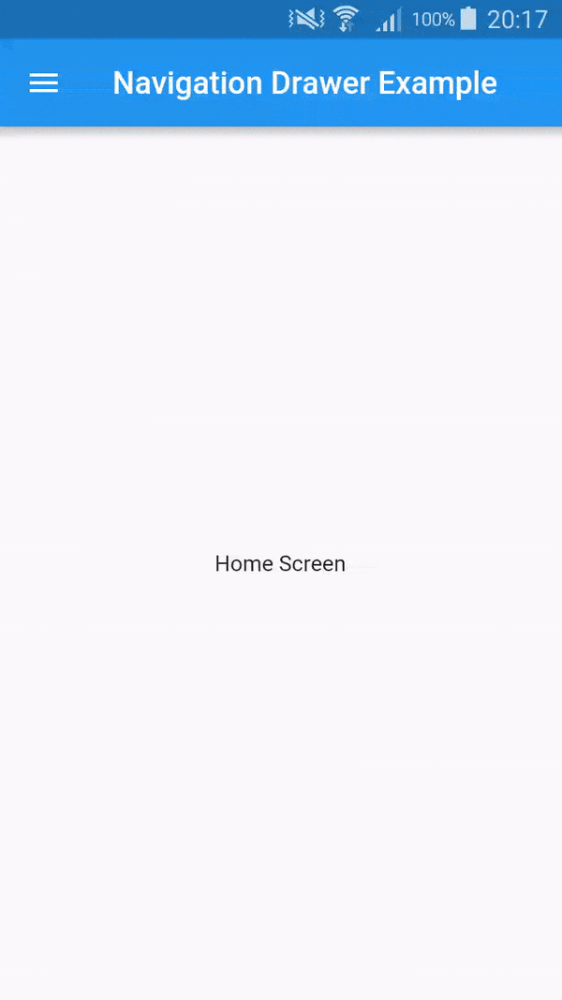

# Add a Drawer to a screen

Steps to Adding Navigation Drawer

1. Create a Scaffold.
2. Add a drawer.
3. Populate the drawer with items.
4. Close the drawer programmatically.

Example app showing implementing navigation Drawer.

## Getting Started

For help getting started with Flutter, view online [documentation](http://flutter.io/).
Best Coding Site
